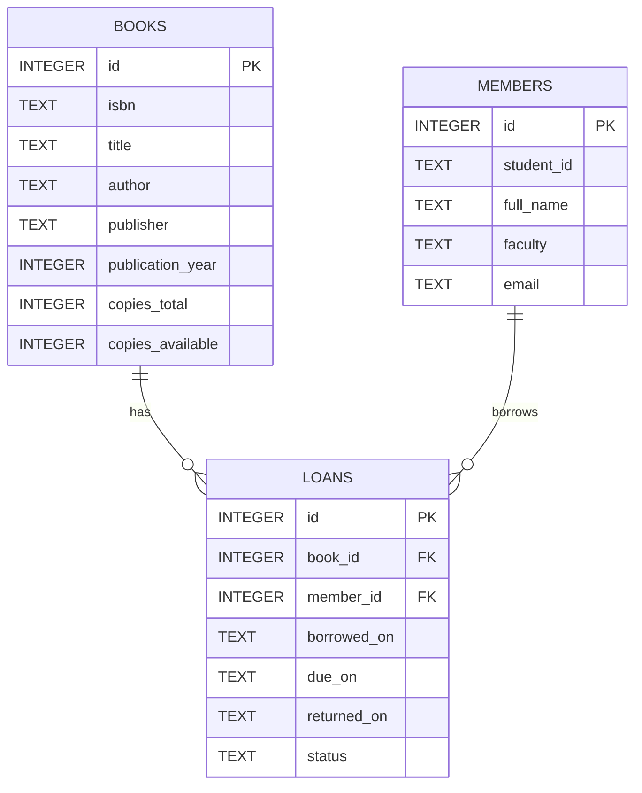

# Appendix: Database Schema and ERD

This appendix contains the SQL schema (DBRM) and an ERD (Mermaid format) for the implemented backend.

## 1) SQL Schema

The full DDL was exported to `docs/exports/library-schema.sql`. It defines the following tables:

- `books` — bibliographic records and copy counts
- `members` — student / patron records
- `loans` — circulation transactions (borrowing, return)

You can include the SQL snippet in your report or import it into an SQLite viewer.

## 2) ERD (Mermaid)

Paste the following Mermaid block into any Markdown renderer that supports Mermaid (or convert to PNG using a Mermaid CLI):

## 3) How I generated these files

- SQL schema: `sqlite3 src/backend/storage/library.db ".schema" > docs/exports/library-schema.sql` (already executed)
- API sample output saved to `docs/exports/api-books-sample.json` (shows `[]` because no books have been added yet).

## 4) How to include the schema/ERD in your DOCX

1. Open `docs/exports/library-schema.sql` and copy the SQL into an appendix section of your Word document.
2. For ERD, either render the Mermaid diagram to PNG (with a CLI like `mmdc`) and insert the image into the DOCX, or paste the mermaid text in an appendix and include a short rendered diagram screenshot.

---

If you want, I can also:

- Generate a PNG of the ERD (if `mmdc` / Mermaid CLI is available on your machine),
- Produce a formatted ERD image and insert it into the LaTeX/Markdown report,
- Or run a sample flow to create one or two books and show API responses (POST examples).
