# Admin Portal Guide

This guide walks through every view that an administrator (or super administrator) can reach via `/admin`. Use it as the backbone of your public wiki.

## Navigation Map
| Menu | URL | Key Capabilities |
| ---- | --- | ---------------- |
| Dashboard | `/admin/index.php` | KPIs, recent activity, quick links |
| Books | `/admin/books.php` | CRUD books, filtering, sample data reload |
| Branches | `/admin/branches.php` | Manage branches and contact info |
| Shelves | `/admin/shelves.php` | Assign shelves to branches and floors |
| Subjects | `/admin/subjects.php` | Define academic domains |
| Members | `/admin/members.php` | Create, reset, or deactivate members |
| Staff | `/admin/staff.php` | Manage library employees |
| Loans | `/admin/loans.php` | Check-out, returns, overdue status |
| Reservations | `/admin/reservations.php` | Hold queue, approvals |
| Fines | `/admin/fines.php` | Assess, waive, and collect |
| Notifications | `/admin/notifications.php` | Templates and audit log |
| Reports | `/admin/reports.php` | Circulation analytics |
| Operations (super admin only) | `/admin/operations.php` | Maintenance tasks, data tools |

## Visual Tour

### Dashboard snapshot

- KPI tiles surface catalog, member, loan, and overdue counts.
- "User sign-ins" highlights the live staff/member feed captured by `UserSessionRepository`.
- Quick action buttons link to the most-used modules.

### Books workspace
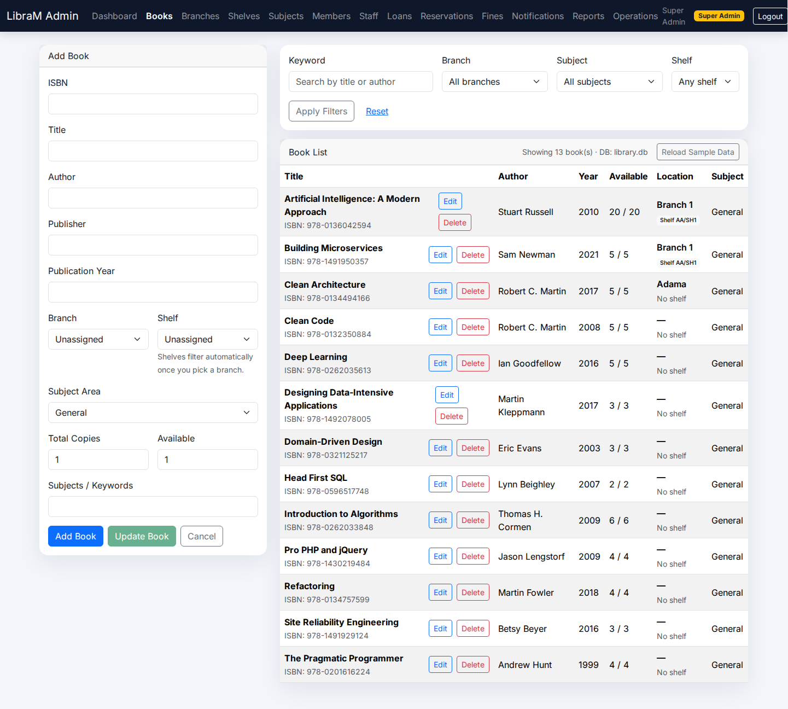
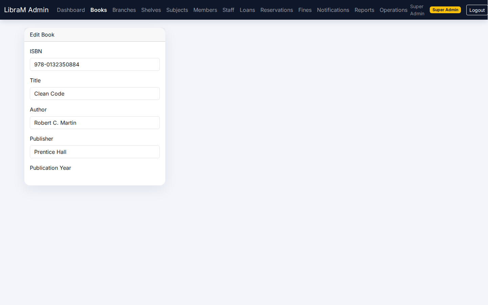

- Inline action buttons for Edit/Delete/Copy live beside each record.
- The shared form (right-hand column) populates when editing an existing item.

### Branches, shelves, and subjects
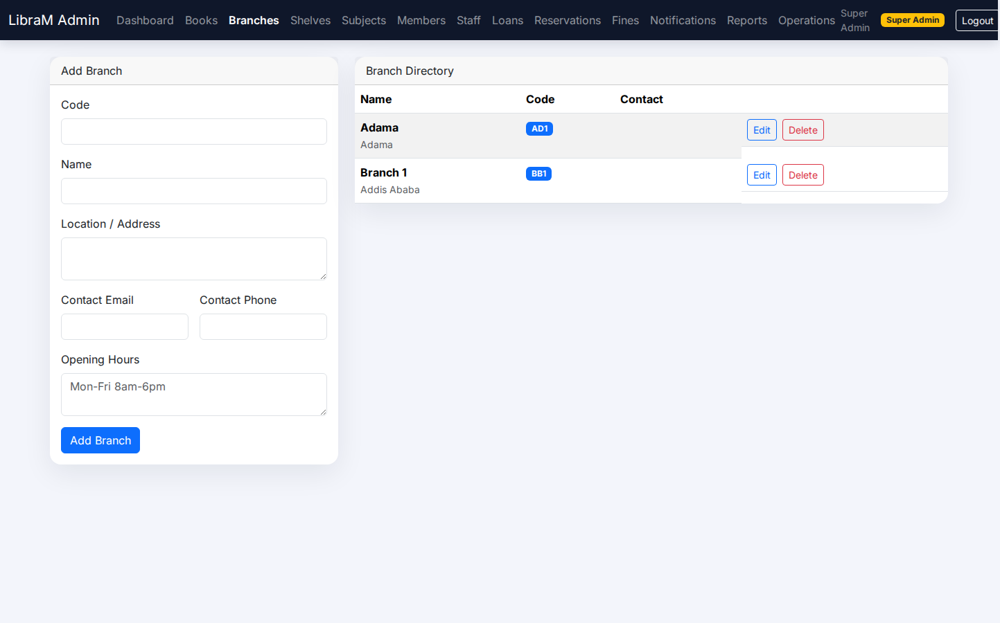
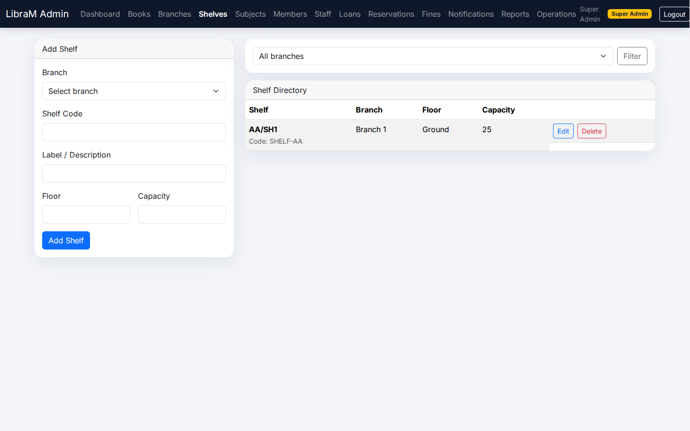
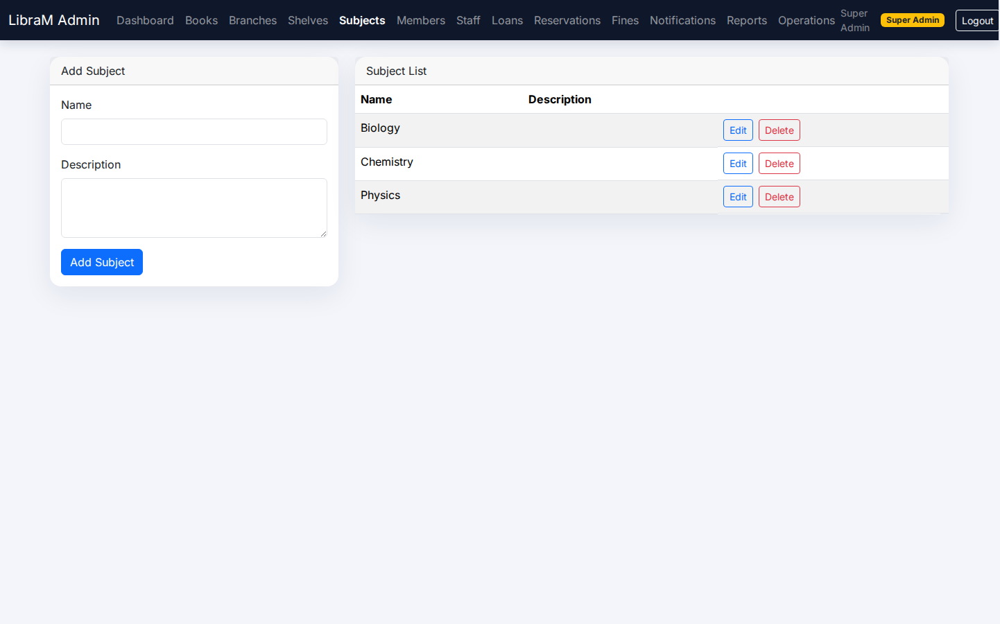

- Branches card layout displays contact info plus the creation form.
- Shelves list binds branch/floor filters and provides visual location badges.
- Subjects view combines taxonomy maintenance with usage counts.

### People operations
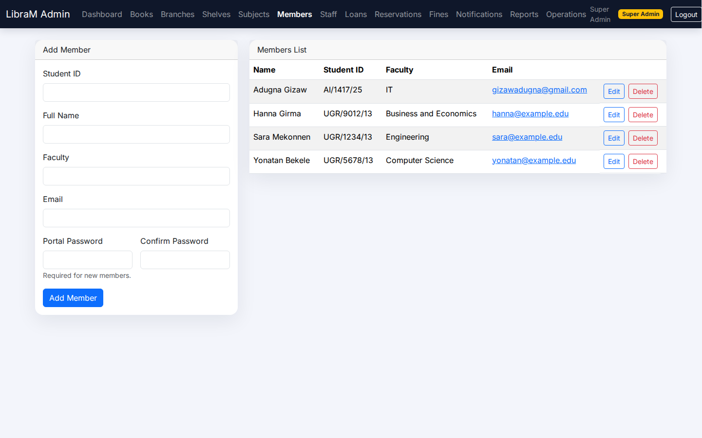
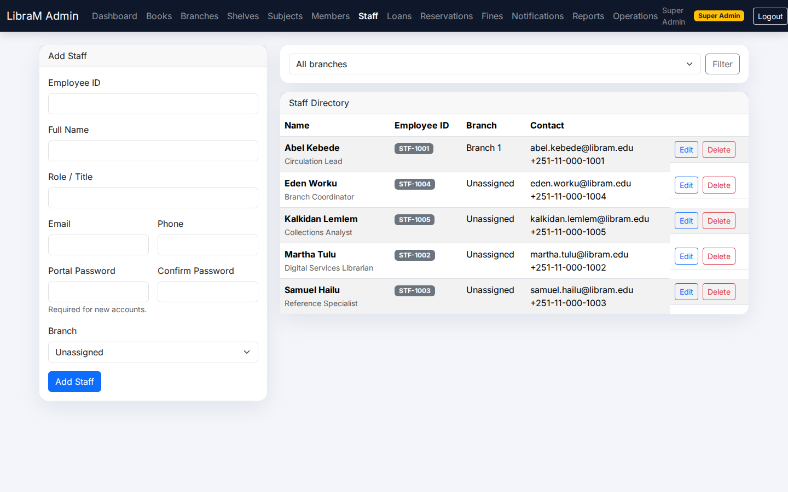

- Member actions (edit, reset password, delete) sit inline for rapid circulation work.
- Staff view exposes role labels and branch assignments for clarity.

### Circulation workflow
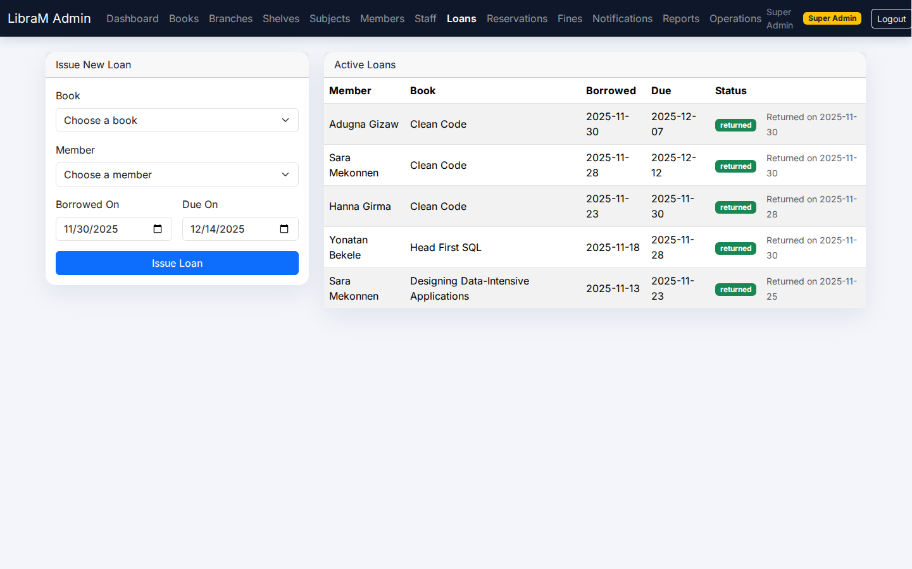
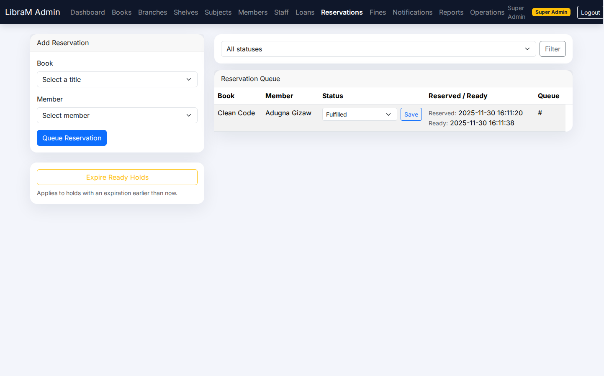

- Status badges (borrowed, overdue, ready, unpaid) provide at-a-glance context.
- Reservations list shows queue position, while the fines screen totals outstanding balances.

### Communications & reporting
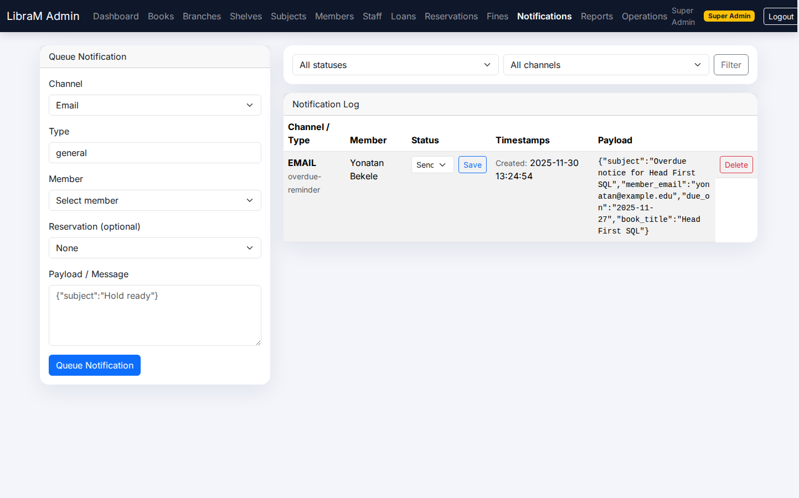
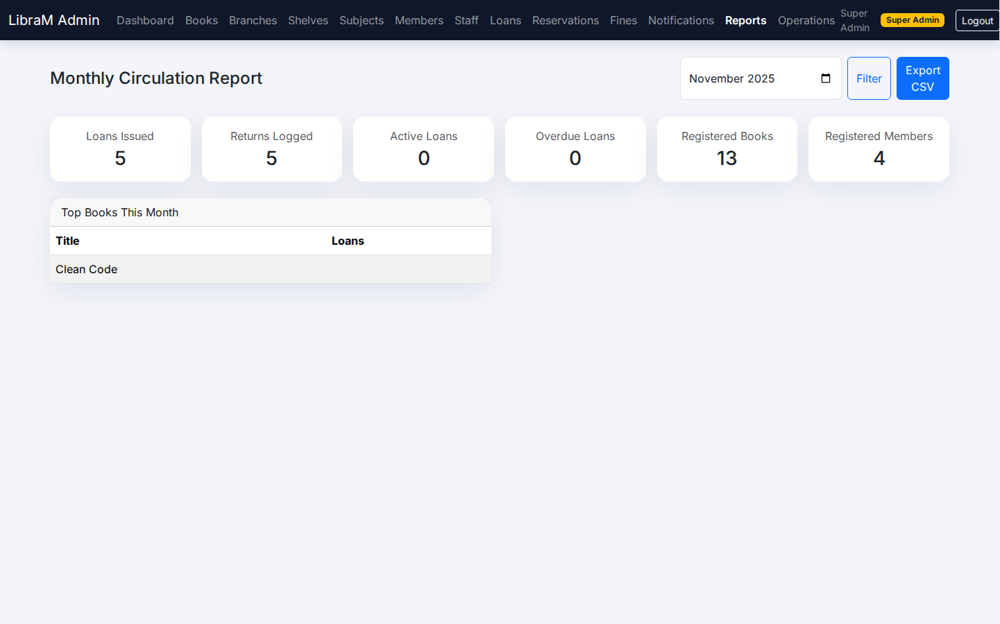

- Template editor plus send history demonstrates the notification stack.
- Reports panel aggregates circulation analytics for leadership updates.

### Super-admin operations
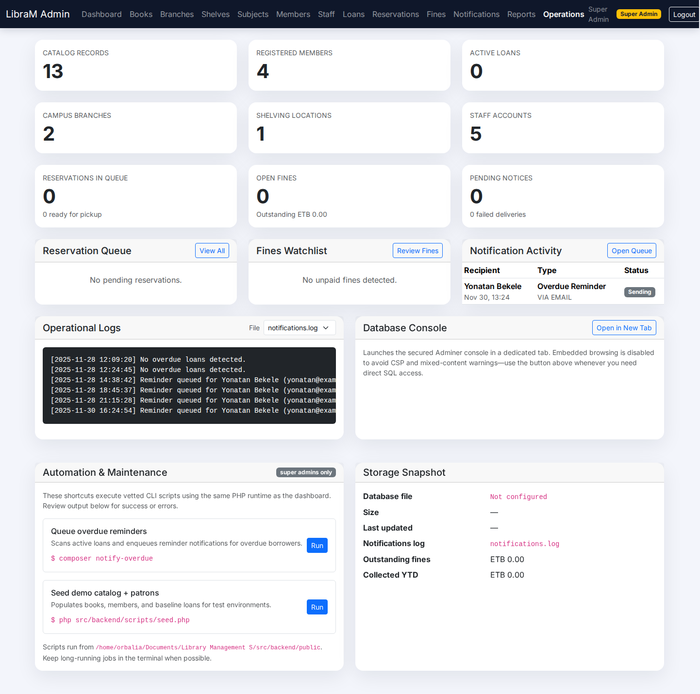

- Exposes data maintenance, seed reload, and troubleshooting shortcuts restricted to super admins.

## Books Module Highlights
- **Shared Form:** Add and Edit actions reuse a single form with Add + Update buttons. Clicking *Edit* inline populates the form without page reload.
- **Validation Rules:** Required ISBN/title/author, unique ISBN, copy counts consistent, shelf must belong to branch, publication year range check.
- **Filtering:** Keyword, branch, subject, and shelf filters execute server-side via `BookRepository::all()`.
- **Sample Loader:** Super admins can rerun `scripts/seed.php` via the "Reload Sample Data" button.

## Admin UX Patterns
- Entries render inside responsive cards with Bootstrap 5.
- Delete actions use inline confirmation dialogs (`onsubmit="return confirm(...)"`).
- Layout includes persistent navbar with role badge (Admin vs Super Admin).

## Access Control
- Credentials come from `.env` (`ADMIN_USER`, `SUPER_ADMIN_USER`).
- All admin pages call `require_admin_login()`.
- Operations view checks `is_super_admin()` before rendering tools.

## Troubleshooting Checklist
1. **Cannot see CRUD buttons:** Ensure the table is wide enough (actions sit beside the title column).
2. **No data shown:** Run `php scripts/seed.php` from `src/backend` or use the in-app reload button.
3. **Session expired:** Re-login at `/login.php?account=admin`.

Use this file as the basis for your GitHub wiki page named "Admin Portal".