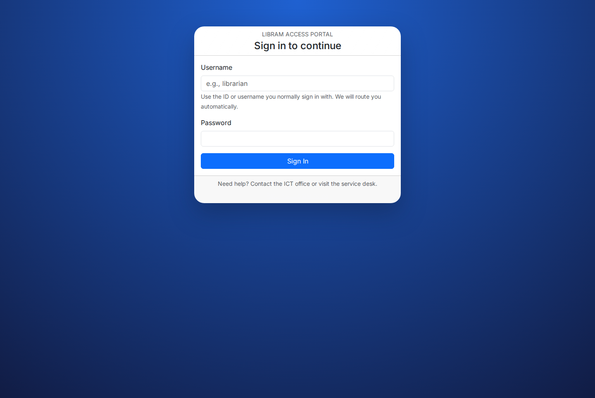
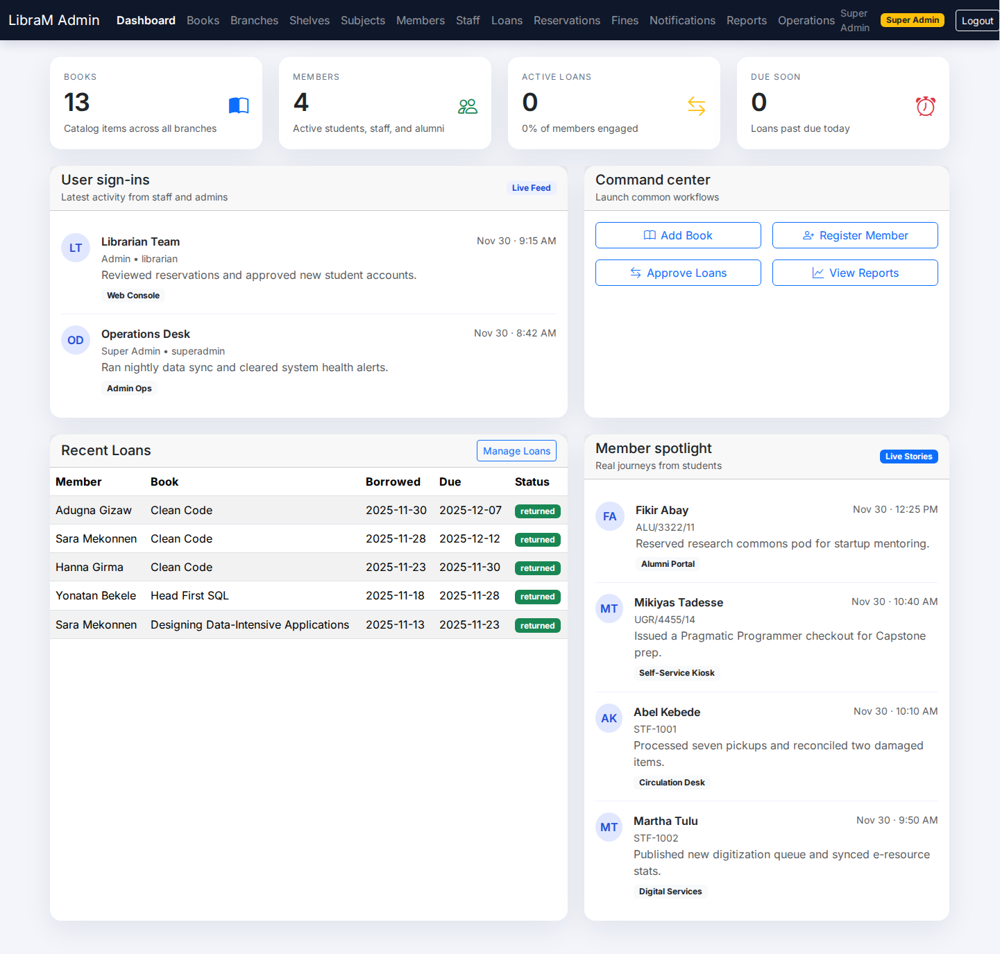
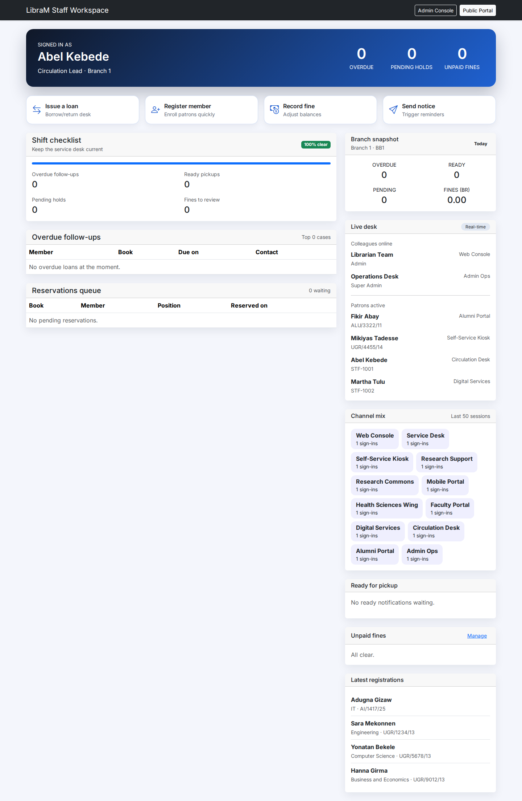
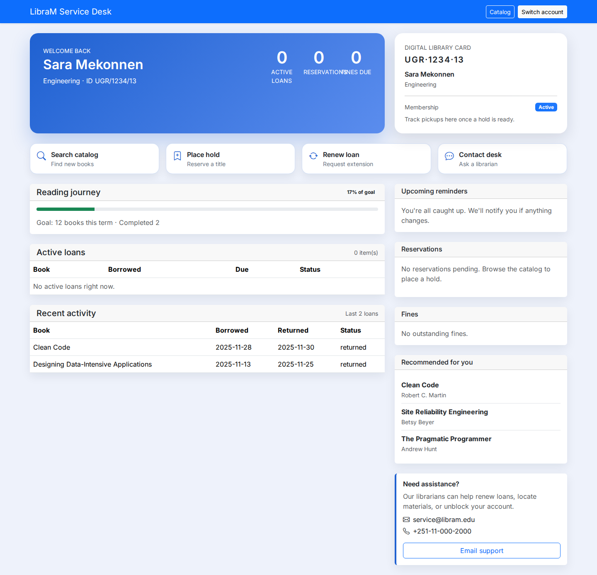

# LibraM Knowledge Base

Welcome to the LibraM documentation hub. Use this wiki as the starting point for anyone who wants to explore, deploy, or extend the Library Management System.

## Contents
- [System Overview](#system-overview)
- [Architecture Summary](Architecture.md)
- [Admin Portal Guide](Admin-Portal.md)
- [Staff & Member Portals](Staff-and-Member-Portals.md)
- [Data Model](Data-Model.md)

## System Overview
LibraM is a PHP 8 / SQLite library management suite that provides:
- Role-based admin dashboard (admin + super admin)
- Full CRUD for branches, shelves, subjects, staff, members, books, loans, reservations, and fines
- Repository-based data access with PDO and schema auto-bootstrap
- Scheduled scripts for seeding sample data and sending notifications

## Visual Highlights
Use these screenshots when publishing the wiki on GitHub. They already live under `wiki/images/`.

| Experience | Preview | Details |
| ---------- | ------- | ------- |
| Public landing page |  | Showcases search, featured titles, and the CTA to access portals. |
| Unified login |  | Demonstrates the shared entry point for admin, staff, and member accounts. |
| Admin dashboard |  | Highlights circulation KPIs, sign-in feed, and quick actions. |
| Staff workspace |  | Displays shift checklist, branch snapshot, and live desk activity. |
| Member portal |  | Shows the digital card, reading journey, and reminders panel. |

> Tip: When copying this README into the GitHub wiki, keep the relative `images/...` paths. GitHub automatically serves the PNGs from the cloned wiki repository.

## How To Use This Wiki
1. Start with **Architecture Summary** for a high-level view of folders, technologies, and deployment expectations.
2. Jump to the portal-specific guides to understand UI behavior, validation, and workflows.
3. Consult the **Data Model** page when you need schema context, then contribute updates by editing these Markdown files. Copy them into the GitHub Wiki or host them directly from the repo.

## Quick Links
- Source root: `src/backend`
- Seed script: `src/backend/scripts/seed.php`
- Public entry point: `src/backend/public/index.php`

For questions or improvements, open an issue or add a new page inside `docs/wiki/`.