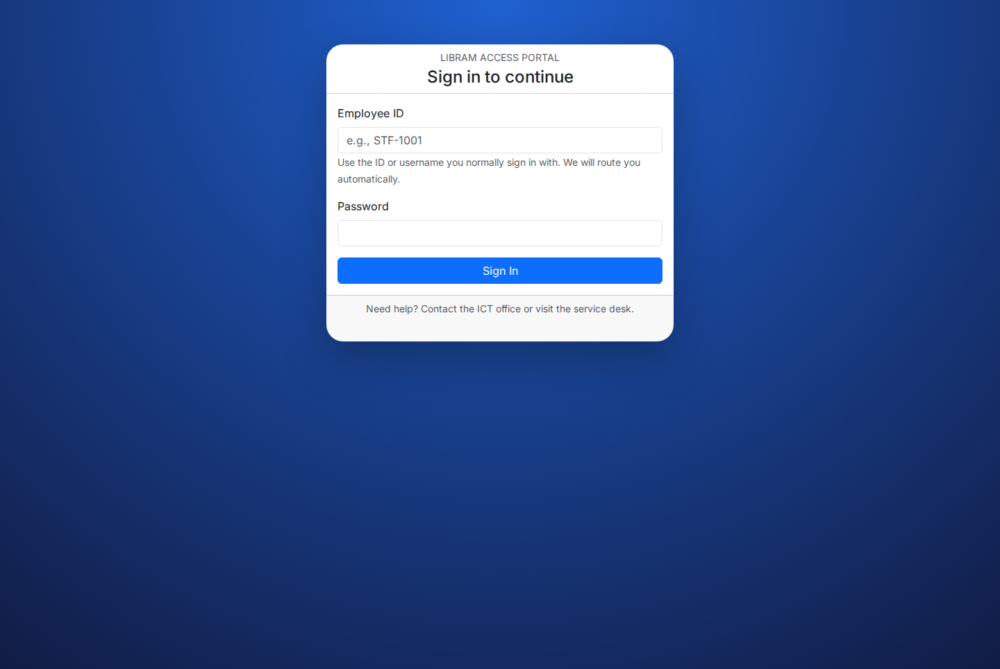

# Staff & Member Portals

This document summarizes the non-admin portals exposed under `/member` and `/staff`.

## Member Portal (`/member/dashboard.php`)

- **Dashboard:** Now combines a personalized hero panel with a digital library card, real-time reminders, and guided actions.
- **Authentication:** Uses `App\Services\PortalAuthenticator` with session state stored via `UserSessionRepository`.
- **Features:**
  - View due dates and overdue status alongside a “Reading Journey” progress meter
  - Display a scannable digital ID card plus pickup and fine reminders
  - Use quick actions (search catalog, place hold, renew, contact desk) without leaving the page
  - Receive automated notifications (driven by `scripts/notify-overdue.php`)

## Staff Portal (`/staff/dashboard.php`)

- **Audience:** Circulation desk and branch operators.
- **Capabilities:**
  - Quick lookup of members and books, plus one-click actions (register, fine, notify)
  - Loan check-in/check-out shortcuts with a shift checklist that tracks overdue, pending, ready, and fine workflows
  - Branch snapshots, live desk activity, and channel mix telemetry for situational awareness

## Shared Components

- **Includes:** `public/includes/portal.php` defines shared layout, nav, and helper functions.
- **Sessions:** Staff and member sessions store user id, role, and branch assignments for authorization.
- **Repositories Used:** `MemberRepository`, `LoanRepository`, `ReservationRepository`, `NotificationRepository`.

## Extending Portals
1. Add new cards/modules inside the relevant dashboard PHP file.
2. Reuse repository methods for data retrieval.
3. Guard new endpoints with role checks (e.g., `require_member_login`).
4. Update the Screenshot Checklist with the new UI section you want to document.

This write-up can become the "Staff & Member Portals" page in your GitHub wiki.